# AutoFlow

**AutoFlow** is a PHP web application for managing a fleet of vehicles and drivers, running in Docker containers. It allows user registration and login, browsing and editing vehicle and driver data, displaying the fleet on a map, and handling notifications about expiring documents.

## 🛠️ Technologies Used

- **Backend:** PHP 8.x, PostgreSQL
- **Frontend:** HTML, CSS, JavaScript, Leaflet.js
- **Architecture:** MVC (Model-View-Controller)
- **Deployment:** Docker, Docker Compose

## 📄 Subpages Overview

### 🔐 Login / Register
  
  Forms enabling you to create an account and log in to the system.

  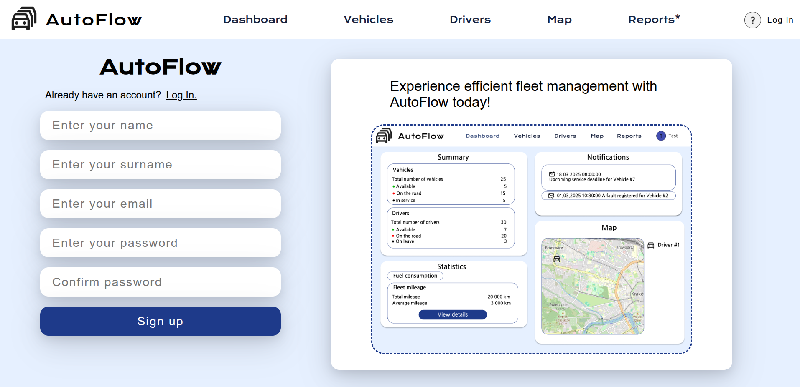

  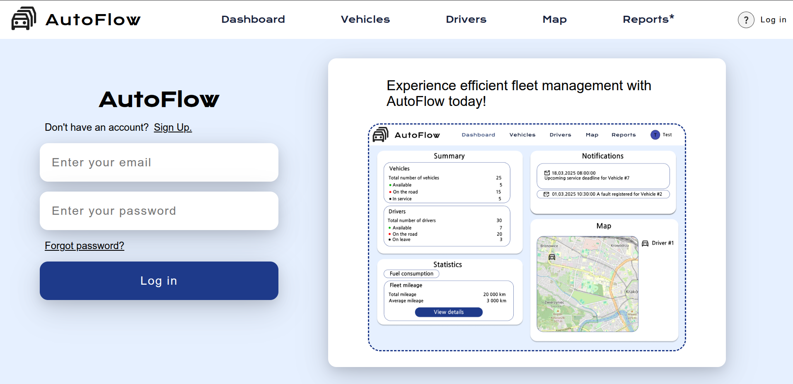

  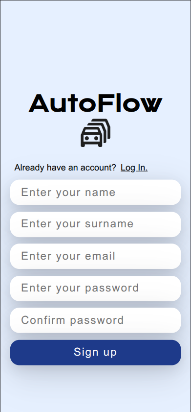

  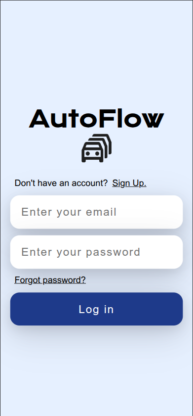

### 📊 Dashboard

  General view: number of vehicles/drivers, notifications, average and total fuel consumption/mileage. Map and vehicle list.

  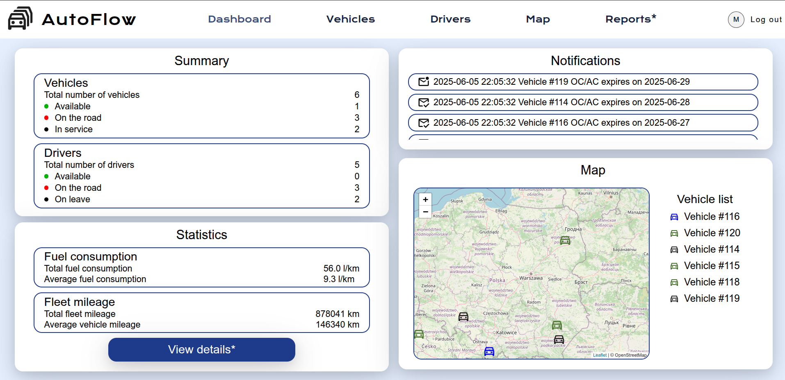

  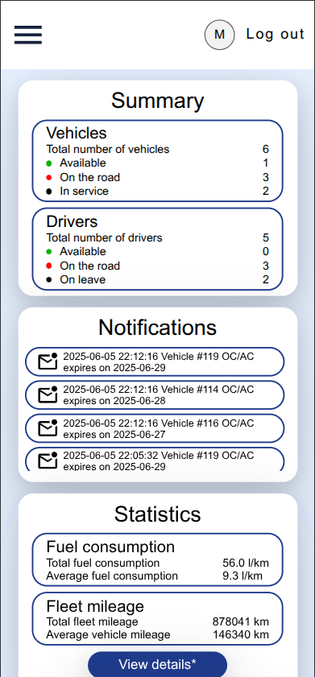

### 🚗 Vehicles

  General information. Number of Available/On the road/In service vehicles. Vehicle list, adding form, assigning to a driver, delete vehicle button. Detailed information about specific id (chosen) vehicle.

  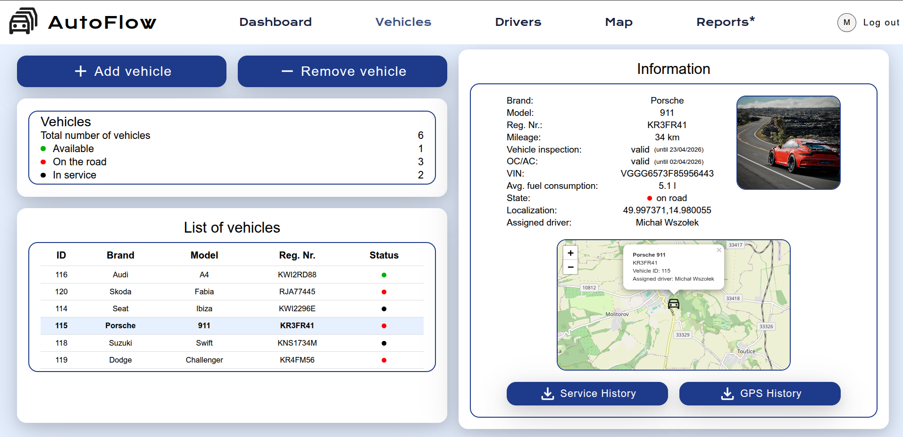

  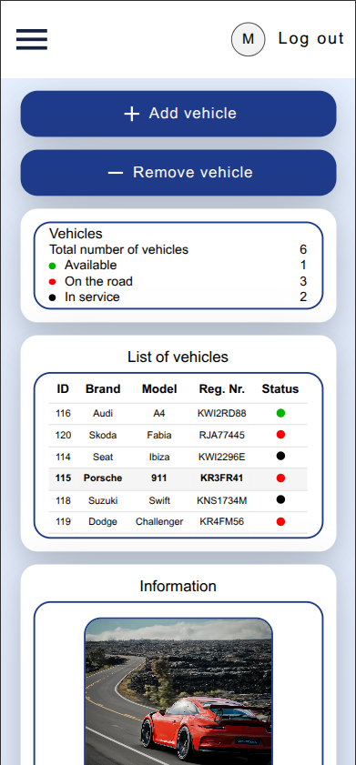

### 👤 Drivers

  General information. Number of Available/On the road/On leave drivers. Driver list, adding form, assigning to a vehicle, delete driver button. Detailed information about specific id (chosen) driver.

  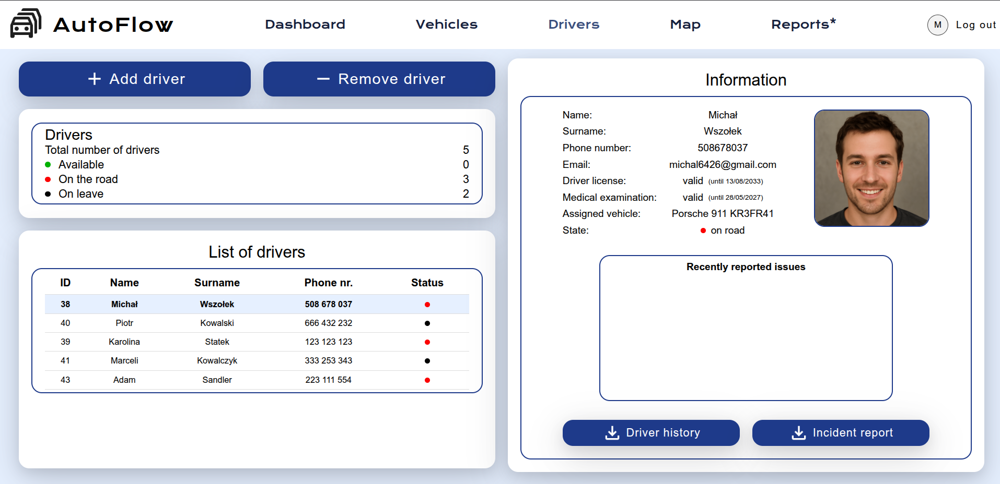

  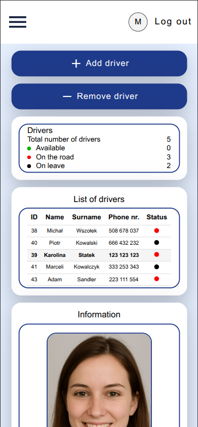

### 🗺️ Map

Interactive map showing vehicle locations (Leaflet.js). On click (marker) information: brand, model, registration number, vehicle id, assigned driver (if any)

  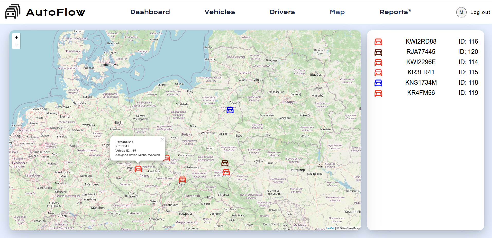

  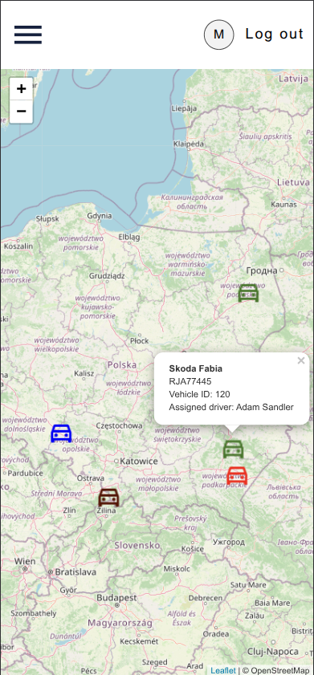

## 🚀 How It Works
    
  1. Go to [http://localhost:8080/register](http://localhost:8080/register) to create a new account.

  2. Log in at [http://localhost:8080/login](http://localhost:8080/login).

  3. After logging in, you can:
    - View the **Dashboard** with fleet stats and notifications.
    - **Add, edit, or delete** vehicles and drivers.
    - View the **map** with real-time vehicle positions.
    - Receive **AJAX-based notifications** about expiring documents.
    - Log out using the top navigation.

  Form inputs are validated (e.g., VIN, email, phone number, expiry dates).

## 🔄 Assignment Logic

- When adding a driver or vehicle, there is:
  - **70% chance** it will be marked as `available`
  - **30% chance** it will be `in_service` (vehicles) or `on_leave` (drivers)

- If the added object is `available`, the system checks for an available object of the opposite type (driver ↔ vehicle):
  - If found, they are automatically **assigned** to each other.
  - Their statuses are updated to `on_road`.

- If one of the assigned objects is deleted:
  - The remaining one is set back to `available`.

